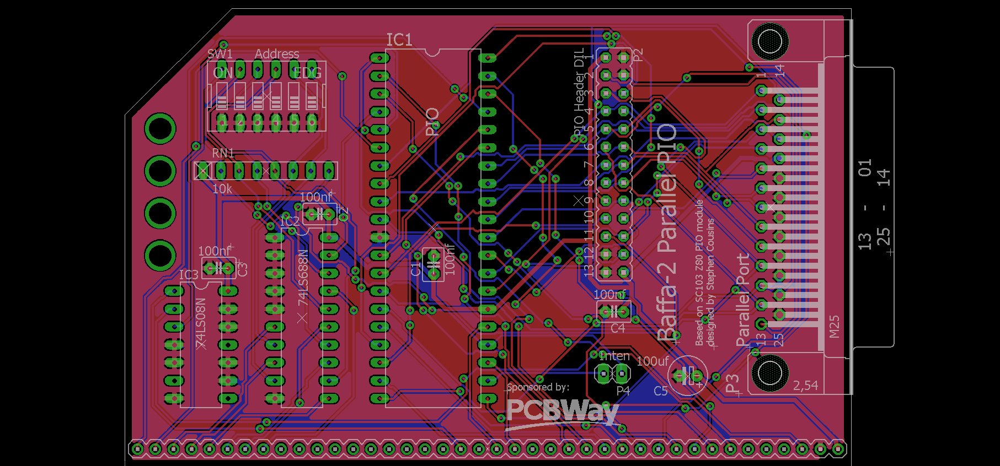
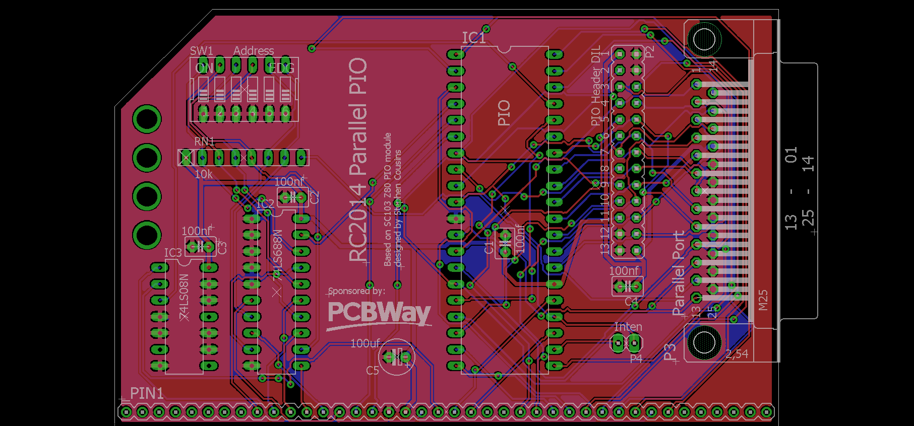

# Baffa-2 Printer Interface 
This is an old school printer interface for the Baffa-2 Homebrew computer. The interface is based on the [SC103 Z80 PIO](https://smallcomputercentral.wordpress.com/sc103-z80-pio-module-rc2014/) board created by Stephen Cousins for RC2014 and modified to support the centronics cable via DB25 connector.

* [Baffa-2 Homebrew Computer on Hackaday.io](https://hackaday.io/project/183266-baffa-2-homebrew-microcomputer)
* [Baffa-2 Printer Interface on Hackaday.io](https://hackaday.io/project/184897-baffa-2-printer-interface)

  

Baffa-2 Homebrew Computer is proudly sponsored by [PCBWay](https://www.pcbway.com/)

---
<a href="https://www.pcbway.com/project/shareproject/Baffa_2_Parallel_IO_Printer_Interface_c841221f.html">Order Baffa-2 Printer Interface PCB from PCBWay</a>

## RC2014 Printer Interface

<a href="https://www.pcbway.com/project/shareproject/RC2014_Parallel_Printer_Interface_0e53e84f.html">Order RC2014 Printer Interface PCB from PCBWay</a>

## Bill of Materials

| Qty | Value | Parts | Description |
|:---:|:----------:|:-----|:-----|
| 4 | 100nf | C1, C2, C3, C4 | CAPACITOR |
| 1 | 100uf | C5 | POLARIZED CAPACITOR |
| 1 | 10k | RN1 | RESISTOR NETWORK |
| 1 | 74LS08N | IC3 | Quad 2-input AND gate |
| 1 | 74LS688N | IC2 | 8-bit MAGNITUDE/IDENTITY COMPARATOR |
| 1 | SW_DIP-6 | SW1 | DIP SWITCH |
| 1 | PINHD-1X2 | P4 | PIN HEADER |
| 1 | Z80PIO | IC1 | Z80 FAMILY DEVICE |
| 1 | PINHD-1X40 | J1 | PIN HEADER |
| 1 | JP13Q | P2 | PIO Header DIL |
| 1 | DB25H | P3 | DB25 connector |

## License

Copyright (c) 2022 Augusto Baffa

Permission is hereby granted, free of charge, to any person obtaining a copy
of this software and associated documentation files (the "Software"), to deal
in the Software without restriction, including without limitation the rights
to use, copy, modify, merge, publish, distribute, sublicense, and/or sell
copies of the Software, and to permit persons to whom the Software is
furnished to do so, subject to the following conditions:

The above copyright notice and this permission notice shall be included in all
copies or substantial portions of the Software.

THE SOFTWARE IS PROVIDED "AS IS", WITHOUT WARRANTY OF ANY KIND, EXPRESS OR
IMPLIED, INCLUDING BUT NOT LIMITED TO THE WARRANTIES OF MERCHANTABILITY,
FITNESS FOR A PARTICULAR PURPOSE AND NONINFRINGEMENT. IN NO EVENT SHALL THE
AUTHORS OR COPYRIGHT HOLDERS BE LIABLE FOR ANY CLAIM, DAMAGES OR OTHER
LIABILITY, WHETHER IN AN ACTION OF CONTRACT, TORT OR OTHERWISE, ARISING FROM,
OUT OF OR IN CONNECTION WITH THE SOFTWARE OR THE USE OR OTHER DEALINGS IN THE
SOFTWARE.
